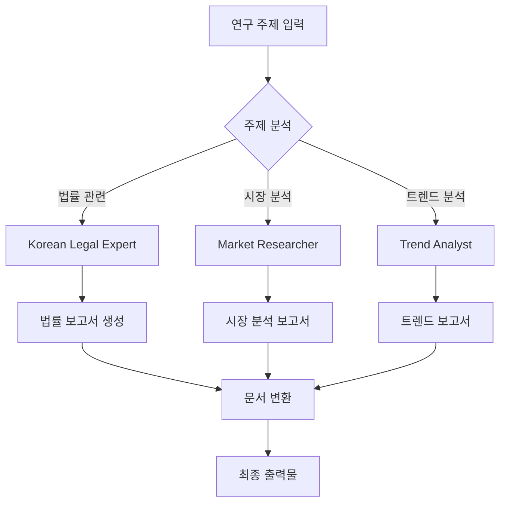
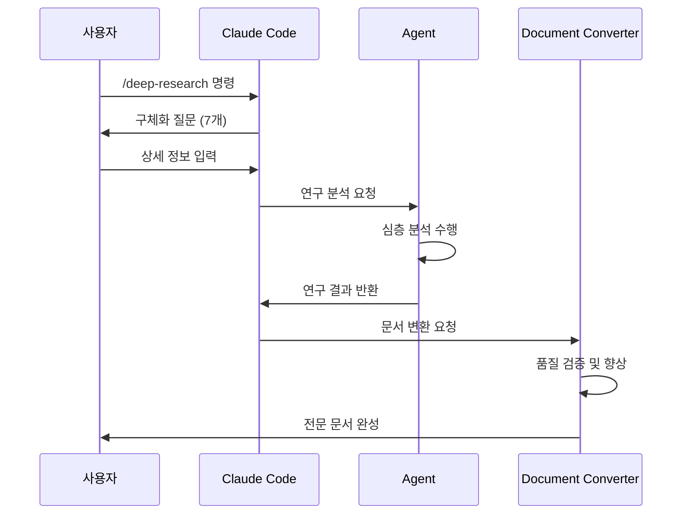

# 고급 기능 테스트 문서

## 목차 (Table of Contents)
[TOC]

## 1. Mermaid 다이어그램 테스트

### 플로우차트


### 시퀀스 다이어그램


## 2. 수학 수식 테스트 (KaTeX)

### 인라인 수식
개인정보보호법 위반 시 과징금은 $P = R \times 0.03$ (매출액의 3% 이하)로 계산됩니다.

### 블록 수식
손해배상액 계산 공식:

$$
D = \sum_{i=1}^{n} (P_i \times L_i \times S_i)
$$

여기서:
- $D$ = 총 손해배상액
- $P_i$ = 개인정보 유출 건수
- $L_i$ = 개별 손해액
- $S_i$ = 가중치 (민감정보 여부)

## 3. 향상된 표 기능

| 구분 | 정부기관 | 법원 | 학술기관 | 기타 |
|------|----------|------|----------|------|
| 신뢰도 | 높음 | 매우 높음 | 높음 | 보통 |
| 가중치 | 0.4 | 0.3 | 0.3 | 0.1 |
| 예시 | law.go.kr | scourt.go.kr | scholar.google | 기타 |

## 4. 체크리스트

연구 문서 품질 확인:

- [x] 출처 링크 검증 완료
- [x] 법률 인용 형식 확인
- [x] 신뢰도 점수 계산
- [ ] 전문가 검토 필요
- [ ] 최종 승인 대기

## 5. 각주^1^ 및 인용

이것은 각주가 있는 텍스트입니다^2^.

---

^1^ 첫 번째 각주입니다.
^2^ 두 번째 각주입니다.

## 6. 코드 블록

```python
def calculate_quality_score(sources):
    """문서 품질 점수 계산"""
    gov_weight = sources['government'] * 0.4
    legal_weight = sources['legal'] * 0.3
    academic_weight = sources['academic'] * 0.3
    
    return min(100, (gov_weight + legal_weight + academic_weight) * 100)
```

## 결론

이 문서는 다양한 고급 기능들이 정상적으로 렌더링되는지 확인하기 위한 테스트 문서입니다. Mermaid 다이어그램, KaTeX 수식, 향상된 표, 각주 등이 모두 법률 문서 템플릿에서 올바르게 표시되어야 합니다.